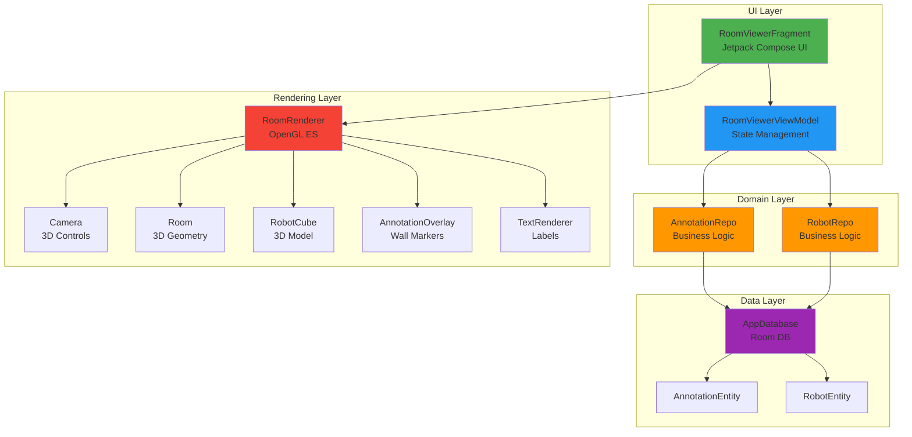
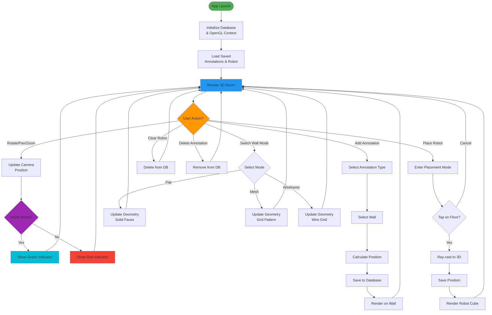

# 🤖 Robot Operator - 3D Construction Site Viewer

An intuitive Android app that lets you visualize construction site rooms in 3D, annotate walls with work areas, and place robots - all powered by OpenGL ES and modern Android architecture.

## ✨ What Can You Do?

- **Explore in 3D**: Navigate a realistic construction room with smooth camera controls
- **Mark Your Walls**: Add colored annotations to identify spray areas, sanding zones, and obstacles
- **Place Your Robot**: Position a robot in the room and visualize its location
- **Switch Wall Views**: Toggle between flat, mesh, and wireframe wall rendering
- **Track Your Position**: Real-time indicator shows if you're inside or outside the room
- **Save Everything**: All your work is automatically saved to local storage

## 🎯 Quick Start
### 📱 Download APK
[Download the latest APK](Apk/10X_assign.apk)
  Click view raw to download apk file.


```bash
# Clone the repository
git clone(https://github.com/adit9852/OpenGL_Final)

# Open in Android Studio and sync dependencies

# Build and run
./gradlew assembleDebug
./gradlew installDebug
```

**Requirements:** Android 7.0+ (API 24), Android Studio Hedgehog or later

## 🎮 How to Use

### Camera Controls
- **One finger drag** → Rotate camera around the room
- **Two finger drag** → Pan left/right/up/down
- **Pinch** → Zoom in and out

### Adding Annotations
1. Tap **"Annotations"** in the top bar
2. Choose your annotation type (Spray Area, Sand Area, or Obstacle)
3. Select which wall to mark
4. The annotation appears as a colored rectangle on the wall
5. Tap on annotations to view details or delete them

### Placing the Robot
1. Tap **"Place Robot"** button (turns orange)
2. Tap anywhere on the floor to place the robot
3. Tap **"Cancel Place"** if you change your mind
4. Drag the robot to reposition it
5. Use **"Clear"** to remove the robot

### Wall Rendering Modes
- **Flat** → Solid colored walls (default)
- **Mesh** → Grid pattern for better depth perception
- **Wireframe** → See-through wire grid

## 🏗️ Architecture Overview

This app follows **MVVM + Clean Architecture** principles:



## 🔄 Application Flow



## 📁 Project Structure

```
app/src/main/java/com/example/a10x_assign/
│
├── 📊 data/                     # Data Models & Database
│   ├── AnnotationEntity.kt      # Annotation data class
│   ├── Annotations.kt           # Annotation DAO
│   ├── RobotEntity.kt           # Robot data class
│   ├── Robot.kt                 # Robot DAO
│   └── AppDatabase.kt           # Room database setup
│
├── 💉 di/                       # Dependency Injection
│   └── AppModule.kt             # Hilt modules
│
├── 🎨 opengl/                   # 3D Rendering Engine
│   ├── Camera.kt                # Camera controls & position tracking
│   ├── Room.kt                  # 3D room geometry (flat/mesh/wireframe)
│   ├── RobotCube.kt             # Robot 3D model
│   ├── AnnotationOverlay.kt     # Wall annotation rendering
│   ├── TextRenderer.kt          # Wall & annotation labels
│   ├── RoomRenderer.kt          # Main OpenGL renderer
│   └── RoomSurfaceView.kt       # Touch input handler
│
├── 🗂️ repository/               # Business Logic Layer
│   ├── AnnotationRepo.kt        # Annotation operations
│   └── RobotRepo.kt             # Robot operations
│
└── 🖥️ ui/roomviewer/            # User Interface
    ├── RoomViewerFragment.kt    # Main UI (Compose + OpenGL)
    └── RoomViewerViewModel.kt   # State management
```

## 🛠️ Tech Stack

| Category | Technologies |
|----------|-------------|
| **Language** | Kotlin |
| **UI** | Jetpack Compose (Material 3) |
| **3D Graphics** | OpenGL ES 2.0 |
| **Architecture** | MVVM + Clean Architecture |
| **Dependency Injection** | Hilt/Dagger |
| **Database** | Room (SQLite) |
| **Async** | Kotlin Coroutines + Flow |
| **Build** | Gradle 8.13 |

## 💡 Key Technical Highlights

### 1. **Hybrid UI System**
Combines OpenGL ES for 3D rendering with Jetpack Compose for UI controls - the best of both worlds! A transparent `ComposeView` overlays the `GLSurfaceView`, allowing touch events to intelligently route to the appropriate layer.

### 2. **Smart Camera System**
The camera automatically detects when you're inside or outside the room bounds and updates the indicator in real-time. This helps users maintain spatial awareness while navigating.

### 3. **Thread-Safe Rendering**
All OpenGL operations happen on the GL thread, while UI updates occur on the main thread. Volatile flags ensure safe communication between threads when switching wall rendering modes.

### 4. **Ray-Casting for Placement**
When you tap to place the robot, the app converts your 2D screen touch into a 3D ray, calculates where it intersects with the floor plane, and positions the robot precisely at that point.

### 5. **Dynamic Geometry Generation**
The room can switch between flat, mesh, and wireframe modes on-the-fly by regenerating vertex buffers with different geometry patterns - all without recreating the OpenGL context.

### 6. **Persistent State Management**
Everything you create is immediately saved to the local Room database and automatically restored when you reopen the app - even after device rotation or app shutdown.

## 🎨 Color Coding

- **Spray Area** → Red annotations
- **Sand Area** → Yellow annotations
- **Obstacle** → Orange annotations
- **Inside Room** → Green indicator
- **Outside Room** → Red indicator
- **Flat Walls** → Blue-gray button
- **Mesh Walls** → Purple button
- **Wireframe** → Cyan button

## 🐛 Known Limitations

1. **Robot Model**: Currently uses a simple cube representation instead of the full UR10e URDF model (planned enhancement)
2. **Annotation Editing**: Once placed, annotations cannot be resized or moved (only deleted)
3. **No Undo**: No undo/redo functionality for actions

## 🚀 Future Roadmap

- [ ] Full UR10e robot model with articulated joints
- [ ] Drag-to-resize annotations
- [ ] Export room configuration to JSON/XML
- [ ] Multiple room support with different dimensions
- [ ] AR mode using ARCore
- [ ] Path planning visualization for robot movement

## 🔧 Troubleshooting

**Blank screen on launch?**
- Ensure your device supports OpenGL ES 2.0
- Check Android version is 7.0 or higher

**Performance issues?**
- The app uses continuous rendering for smooth animations
- On older devices, you can optimize by modifying `RENDERMODE_CONTINUOUSLY` to `RENDERMODE_WHEN_DIRTY`

**Build errors?**
```bash
./gradlew clean
./gradlew assembleDebug
```

## 📄 License

Created as part of an Android development internship assignment.

---

**Made with ❤️ using Kotlin, OpenGL ES, and Jetpack Compose**
